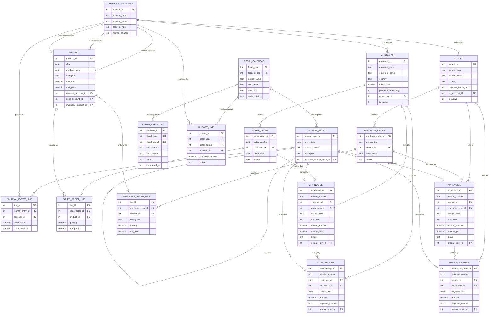

# Entity Relationship Diagram

## How to read this

- **PK** = Primary Key, **FK** = Foreign Key
- `||--o{` means "exactly one, to zero-or-many" — e.g. one `CUSTOMER` can
  place zero or many `SALES_ORDER` rows, but every `SALES_ORDER` belongs to
  exactly one `CUSTOMER`.
- `||--o|` means "exactly one, to zero-or-one" — e.g. a `SALES_ORDER` is
  invoiced at most once (into a single `AR_INVOICE`), but not every order
  has to be invoiced yet.

## Design principle visible in this diagram

Notice that `JOURNAL_ENTRY` sits at the centre, connected to every
transactional table (`AR_INVOICE`, `CASH_RECEIPT`, `AP_INVOICE`,
`VENDOR_PAYMENT`). This reflects the core architecture decision: the
General Ledger is the single source of truth, and every financial event in
any sub-ledger produces a posting there — never the other way around.

`JOURNAL_ENTRY` also has a self-referencing relationship via
`reverses_journal_entry_id`: a correction entry points back to the
original entry it reverses, rather than the original ever being edited or
deleted. This makes the audit trail explicit and queryable — you can
always find which entry (if any) reversed a given posting.
